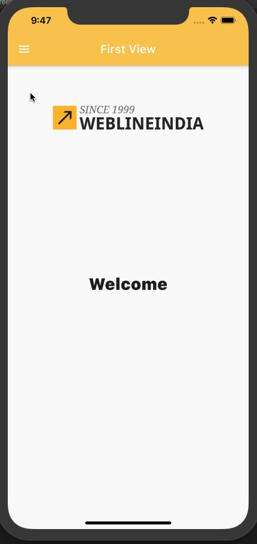

# Flutter - Drawer Component

A Flutter based Reusable Drawer component which provides Drawer menu with configurable items and dynamic views that can be used in any Flutter application.

## Table of contents
- [Flutter Support](#Flutter-support)
- [Demo](#demo)
- [Features](#features)
- [Getting started](#getting-started)
- [Usage](#usage)
- [Methods](#methods)
- [Want to Contribute?](#want-to-contribute)
- [Need Help / Support?](#need-help)
- [Collection of Components](#collection-of-Components)
- [Changelog](#changelog)
- [License](#license)
- [Keywords](#Keywords)

## Flutter Support

Version - Flutter 1.17 (stable)

We have tested our program in above version, however you can use it in other versions as well.

## Demo

------

## Features

* Drawer with Customizable Menu header.
* Drawer with Customizable Menu icons.
* Customizable UI with trailing items.

## Getting started

* Download this sample project and import app_drawer.dart Widget file in your Flutter App. 
* Update Header, Title based on your requirements. 

## Usage

Setup process is described below to integrate in project.

## Configure DrawerMenu in your widget by following below method steps

### Methods

Step 1.Add  'provider' package to pubspec.yaml

Step 2. Add MultiProvider in Your application widget like this
       
    // Put DrawerNavigationProvider as mention below
    class MyApp extends StatelessWidget {
      @override
      Widget build(BuildContext context) {
        final MaterialColor colorCustom = MaterialColor(0xFFFACA58, color);
        return MultiProvider(
          providers: [
            ChangeNotifierProvider.value(
              value: DrawerNavigationProvider(),
            )
          ],
          child: MaterialApp(
            title: 'Flutter Demo',
            home: ...,
          ),
        );
      }
    }
       

Step 3. User following DrawerVC constructor for adding drawer to user main screen             
       
       Color selectedTextColor;
       Color textColor;
       int selectedIndex;
       bool isHeader = true;
       bool isShowIcon = true;
       Widget headerWidget;
       List<DrawerMenuItem> arrDrawerItems;
       Function(int) didItemSelected;
       
       DrawerVC({
            this.arrDrawerItems,
            this.isHeader,
            this.headerWidget,
            this.isShowIcon,
            this.textColor,
            this.selectedTextColor,
            this.didItemSelected,
        });
        
        // Pass DrawerMenuItem Array to the DrawerVC's Constructor
        class DrawerMenuItem {
          String title;
          IconData icon;
          Widget subItemWidget;

          // ignore: sort_constructors_first
          DrawerMenuItem({this.title, this.icon, this.subItemWidget});
        }

Step 4. Pass header widget if you want to add it otherwise skip it  

    this.isHeader = true // if you want to add header make sure you need to set this flag to true
    headerWidget: Widget() 

Step 5.if you want set text color  and selected text color 

    textColor: Colors.white
    selectedTextColor: Colors.white
    
Step 6.if you want enable/disable Drawer item icons 
    
    isShowIcon : true // if you want to show icon the set this to true otherwise false

Step 7.if you want add trailing item icons then pass widget to  DrawerMenuItem class using below constructor   
        
      subItemWidget : Widget() // use this parameter to set trailing icons to drawer
       
    // Pass DrawerMenuItem Array to the DrawerVC's Constructor
           class DrawerMenuItem {
             String title;
             IconData icon;
             Widget subItemWidget;

             // ignore: sort_constructors_first
             DrawerMenuItem({this.title, this.icon, this.subItemWidget});
           }
Step 8. if you want selected index of drawer menu you can get that in following ways 

    class HomeScreen extends StatelessWidget {
      final arrDrawerItems = [
        DrawerMenuItem(title: 'Home', icon: Icons.home, subItemWidget: null),
        DrawerMenuItem(
          title: 'Second View',
          icon: Icons.favorite,
          subItemWidget: const Text('13'),
        ),
        DrawerMenuItem(
            title: 'Third View', icon: Icons.search, subItemWidget: null),
      ]; //List for drawer items

      @override
      Widget build(BuildContext context) {
        return Scaffold(
          drawer: DrawerVC(
            arrDrawerItems: arrDrawerItems,
            headerWidget: _buildHeaderForDrawer(context),
            isHeader: true,
            isShowIcon: true,
            textColor: Colors.black,
            selectedTextColor: Colors.amber,
            didItemSelected: (int selectedIndex) {} // Using this function you get selected index of drawer,
          ),
          appBar: AppBar(
              centerTitle: true,
              iconTheme: const IconThemeData(color: Colors.white),
              // You must implement this Consumer<DrawerNavigationProvider> provide for navigation and  you can also get selected index of drawer
              title: Consumer<DrawerNavigationProvider>(
                builder: (ctx, item, child) {
                  if (item.selectedIndex == 0) {
                    return const Text(
                      'Home',
                      style: TextStyle(color: Colors.white),
                    );
                  } else if (item.selectedIndex == 1) {
                    return const Text('Second View',
                        style: TextStyle(color: Colors.white));
                  } else {
                    return const Text('Third View',
                        style: TextStyle(color: Colors.white));
                  }
                },
              ),
              brightness: Brightness.light),
          body: Center(
          // You must implement this Consumer<DrawerNavigationProvider> provide for navigation and  you can also get selected index of drawer
            child: Consumer<DrawerNavigationProvider>(
                  builder: (ctx, item, child) {
                    if (item.selectedIndex == 0) {
                      return YOUR_WIDGET();
                    } else if (item.selectedIndex == 1) {
                      return YOUR_WIDGET();
                    } else {
                      return YOUR_WIDGET();
                    }
                  },
                ) ??
                const Text('No data'),
          ),
        );
      }
    }
    
------

## Want to Contribute?

- Created something awesome, made this code better, added some functionality, or whatever (this is the hardest part).
- [Fork it](http://help.github.com/forking/).
- Create new branch to contribute your changes.
- Commit all your changes to your branch.
- Submit a [pull request](http://help.github.com/pull-requests/).

------

## Need Help? 
If you need help then feel free to contact our [Flutter developers](https://www.weblineindia.com/flutter-cross-platform-mobile-app-development.html).

 ------
 
## Collection of Components
 We have built many other components and free resources for software development in various programming languages. Kindly click here to view our [Free Resources for Software Development.](https://www.weblineindia.com/software-development-resources.html)
 
------

## Changelog
Detailed changes for each release are documented in [CHANGELOG](./CHANGELOG).

## License

[MIT](LICENSE)

[mit]: https://github.com/weblineindia/Flutter-Drawer/blob/master/LICENSE

## Keywords
Flutter Drawer Menu, Custom Drawer menu, Side menu, FLutter Slider Menu, Custom Slider, Weblineindia
